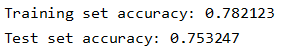
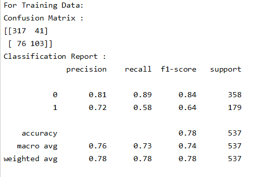
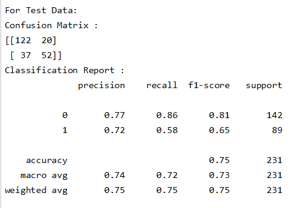
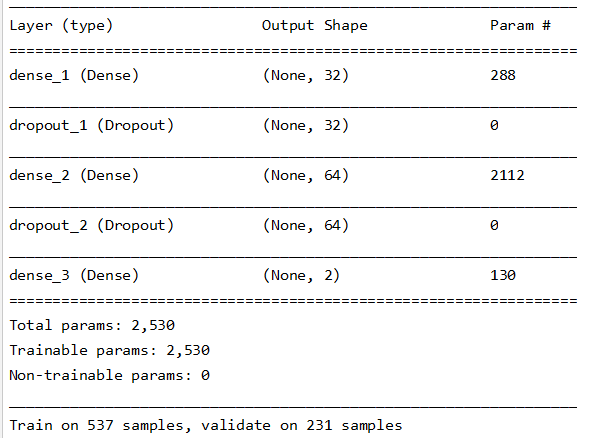
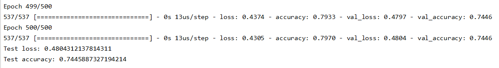

# Deep Learning - MLP on Diabetes Dataset

## Deep Learning Homework 3 No. 9 | Indra Imanuel Gunawan - 20195118
There are two python files in this repository, one is implemented using Python Scikit-learn, while the other one is implemented using Keras. Both of them implemented MLP on the "diabetes dataset", which is also provided in this repository under the directory "/data/diabetes.csv". I will explain about the scikit-learn implementation first, then the Keras one.

## Scikit-learn Implementation

## Setup
Install scikit-learn\
`pip install scikit-learn`

## Run
To run the code, just type this on the terminal (make sure that the directory & environment is correct):\
`python MLP_ScikitLearn_Diabetes.py`

## Results
The results of the experiment include:
1. The program's accuracy on the training and test dataset
2. The confusion matrix on the training and test dataset
3. The classification report on the training and test dataset
Explanation on how to get these results from the code will be explained in the "Code Explanation" section.

### Accuracy

### Confusion Matrix & Classification Report
#### Training Dataset

#### Test Dataset


## Code Explanation
First, import the required libraries and necessary modules
```python
import pandas as pd
from sklearn.neural_network import MLPClassifier
from sklearn.model_selection import train_test_split
from sklearn.metrics import classification_report, confusion_matrix
```

Then, read the data using the pandas library, and set the value for X and y. The values for y is the data in the "Outcome" column, while the rest of the other columns are for the X.
```python
#Getting the data
df = pd.read_csv('data/diabetes.csv')

#Setting some variables
target_column = ['Outcome']
predictors = list(set(list(df.columns))-set(target_column))
df[predictors] = df[predictors]/df[predictors].max() #Normalizing the values for X

X = df[predictors].values
y = df[target_column].values
```

Split the data into training and test dataset. The training takes 70% of the dataset, while the test takes 30%.
```python
X_train, X_test, y_train, y_test = train_test_split(X, y, test_size=0.30, random_state=40)
```

Build the model using the MLPClassifier abnd fit the training data on it
```python
mlp = MLPClassifier(hidden_layer_sizes=(8, 8, 8), activation='relu', solver='adam', max_iter=500)
mlp.fit(X_train, y_train)

predict_train = mlp.predict(X_train)
predict_test = mlp.predict(X_test)
```

This code below is used to see the accuracy of the model:
```python
print("Training set accuracy: %f" % mlp.score(X_train, y_train))
print("Test set accuracy: %f" % mlp.score(X_test, y_test))
```

This code below is used to see the Confusion matrix and Classification Report
```python
#Compare Training data result & original
print("For Training Data:")
print("Confusion Matrix : ")
print(confusion_matrix(y_train, predict_train))
print("Classification Report : ")
print(classification_report(y_train, predict_train))

#Compare Test data result & original
print("For Test Data:")
print("Confusion Matrix : ")
print(confusion_matrix(y_test, predict_test))
print("Classification Report : ")
print(classification_report(y_test, predict_test))
```

## Keras Implementation

## Setup
Install Keras\
`pip install keras`

## Run
To run this code, just type this on the terminal (make sure that the directory & environment is correct):\
`python MLP_Keras_Diabetes.py`

## Results
Here are the summary of the model that has been created in this experiment, and the accuracy of the model when working on the "diabetes dataset"
### Model Summary

### Model Accuracy


## Code Explanation
First, import the required libraries and necessary modules
```python
import pandas as pd
from sklearn.model_selection import train_test_split

import keras
from keras.models import Sequential
from keras.layers import Dense, Dropout
from keras.optimizers import Adam
```
Read the dataset and set the values for X and y
```python
df = pd.read_csv('data/diabetes.csv')
target_column = ['Outcome']
predictors = list(set(list(df.columns))-set(target_column))
df[predictors] = df[predictors]/df[predictors].max()

X = df[predictors].values
y = df[target_column].values
```

Split the data into training and test dataset. The training takes 70% of the dataset, while the test takes 30%.
```python
X_train, X_test, y_train, y_test = train_test_split(X, y, test_size=0.30, random_state=40)
```

Set the batch size, number of classes, and number of epoch in this experiment
```python
batch_size = 128
num_classes = 2
epochs = 500
```

Convert the class vectors to binary class matrices.
```python
y_train = keras.utils.to_categorical(y_train, num_classes)
y_test = keras.utils.to_categorical(y_test, num_classes)
```

Create a sequential model. This model consist of 1 input layer, 1 hidden layer, and 1 output layer, in which each of those layers are followed by a dropout layer with a 0.2 rate. Each layer use relu activation function, except for the output which uses softmax activation.
```python
model = Sequential()
model.add(Dense(32, activation='relu', input_shape=(8,)))
model.add(Dropout(0.2))
model.add(Dense(64, activation='relu'))
model.add(Dropout(0.2))
model.add(Dense(num_classes, activation='softmax'))

model.summary()
```

Compile and fit the model to the data. The model uses categorical cross entropy for the loss function, and Adam as the optimizer
```python
model.compile(loss='categorical_crossentropy',
              optimizer=Adam(),
              metrics=['accuracy'])

history = model.fit(X_train, y_train,
                    batch_size=batch_size,
                    epochs=epochs,
                    verbose=1,
                    validation_data=(X_test, y_test))
```

See the accuracy of the model
```python
score = model.evaluate(X_test, y_test, verbose=0)
print('Test loss:', score[0])
print('Test accuracy:', score[1])
```
